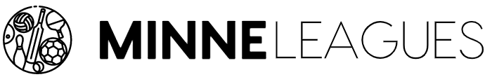
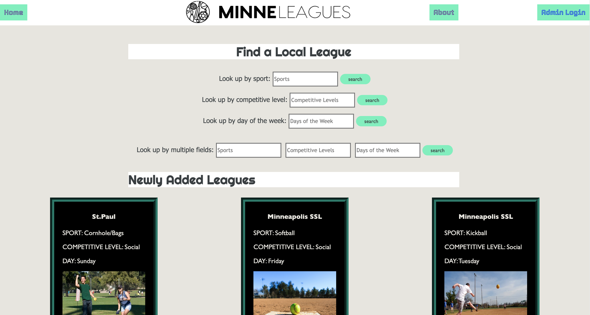

# Minneleagues

## Table of Contents

- [Description](#description)
- [Built With](#built-with)
- [Prerequisites](#prerequisite)
- [Installation](#installation)
- [Usage](#usage)
    

## Description

MinneLeagues is a user-friendly directory for recreational sports leagues across the Twin-Cities and beyond! Users will be able to search for various sports leagues near them using a multitude of criteria, making the application a one stop shop for sports en. They will also be able to read information about the leagues, share it to others or themselves, and click an external link where they can sign up. Admin users have the functionality to add, edit, and delete leagues.

## Screenshots
  
  
  

  
  

  
  

  
  

  
  

## Built With

## Getting Started

This project should be able to run in your favorite IDE. I used VS code while building it. 

### Prerequisites
Before you get started, make sure you have the following software installed on your computer:

- [Node.js](https://nodejs.org/en/)

### Installation

1. Fork the repository
2. Copy the SSH key in your new repository
3. In your terminal type...  `git clone {paste SSH link}`
4. Navigate into the repository's folder in your terminal
5. Open VS Code (or editor of your choice) and open the folder
6. In the terminal of VS Code run `npm install` to install all dependencies
8. Create a database named `minneleagues` in PostgresSQL
If you would like to name your database something else, you will need to change `minneleagues` to the name of your new database name in `server/modules/pool.js`
9. The queries in the database.sql file are set up to create all the necessary tables that you need. Copy and paste those queries in the SQL query of the database. If you'd like to add dummy data in the database to test the app, you can run this command in your code editor terminal, psql -d minneleagues -f dummyDataDump.sql, which will create a postico database using the dummyDataDump.sql file.
10. Run `npm run server` in your VS Code terminal
11. Open a second terminal and run `npm run client`

## Usage

Once everything is installed and running it should open in your default browser - if not, navigate to http://localhost:3000/#/.

Application Presentation: Click Below. 

